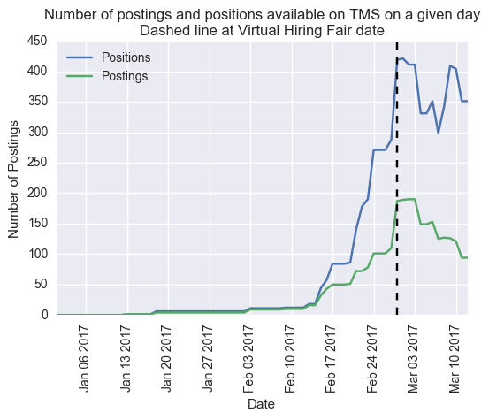
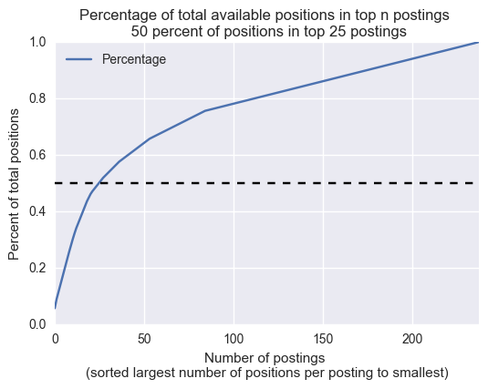
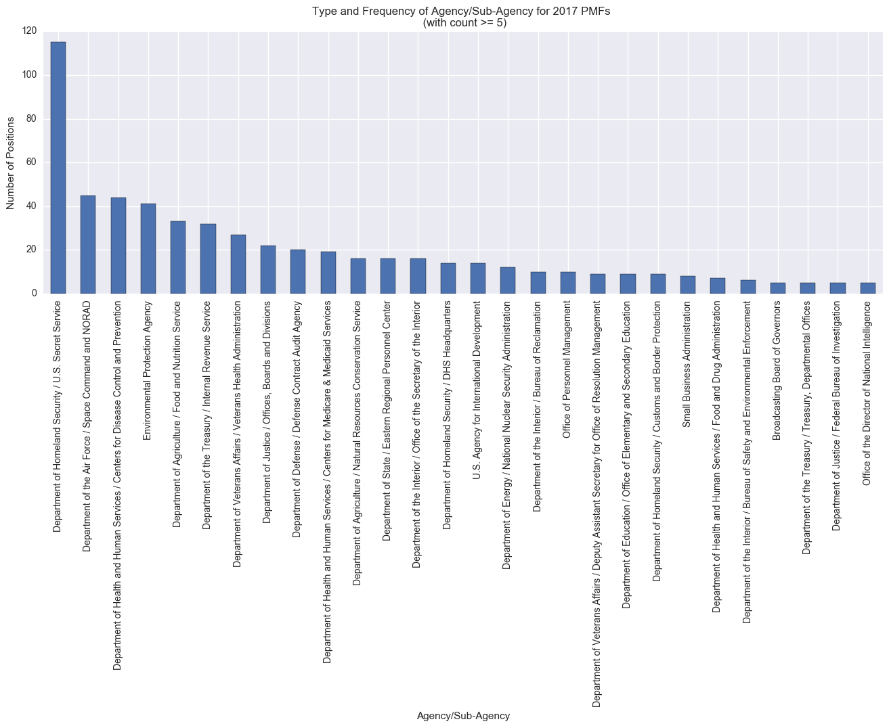
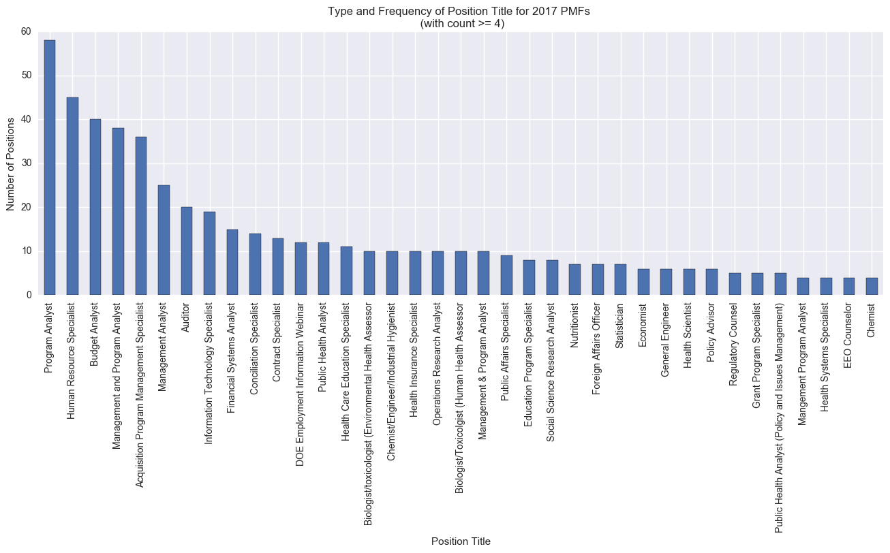
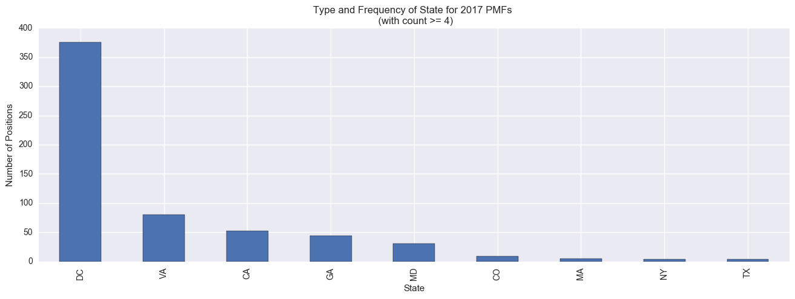

# PMF TMS Scraping and Analysis
iPython notebooks for collecting and analyzing data on the Presidential Management Fellows program

Note: This is an ongoing project and all graphs, tables, and conclusions are subject to change. For example, I just discovered some postings are being updated with different pay grades and/or ending dates. My current method of combining all snap shots only uses the information from the earliest recording of a particular job. I need to modify that to use the most recent snap shot from the TMS. This will affect some information in the csv file and in some graphs.

Notebook 'PMF_TMS_Scrape_and_Study_Github.ipynb' may be used (by those with access) to scrape the Talent Management System of job postings and do some analysis of the results. Scraping results in a snapshot of the TMS's current available postings.

Notebook 'Combined_Analysis_GitHub.ipynb' does analysis on a composite of several different snapshots. Most postings to the TMS up to 03/11/2017 are in this composite.

From the second notebook, some interesting trends can be seen.

First, the number of postings and positions posted on the TMS started quite slow, but rapidly grew before the virtual hiring fair held on 02/28/2017.

Second, while there were more positions (628) than 2017 PMF Finalists (417), a relatively small number of postings contain most of the positions.

Third, the distribution in which agencies are posting, the titles of posted positions, and the location of each position can be made.

