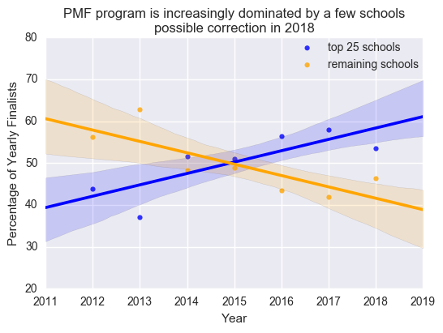
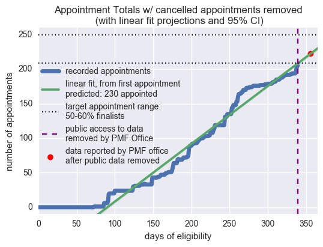
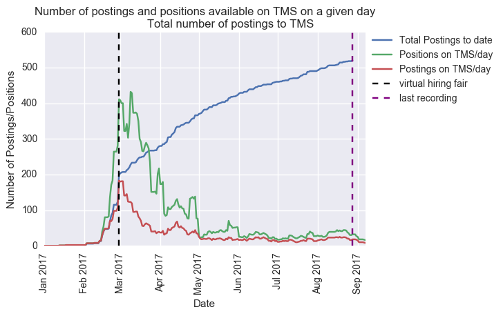
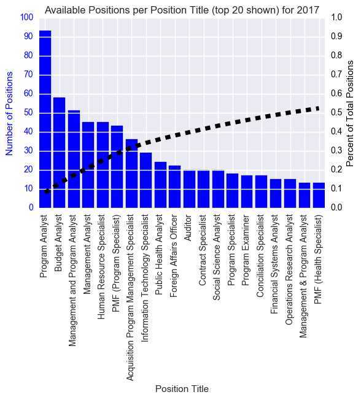

# A collection of data and analysis of the PMF program
This repository contains csv files of collected data, iPython notebooks, select images, and an overall report on various elements of the Presidential Management Fellows Program.

Note: This is an ongoing project and all graphs, tables, and conclusions are subject to change.

The report is saved as a pdf under GitHub_PMF_Report.pdf, and is out of date compared to the selected images/data also found in this repository.

That report has 3 main sections:

1) The recent history of the PMF Finalists, focusing on the growth in the share of Finalists from a few pipeline schools

2) A look into the advanced degrees and appointment rates for the 2016 and 2017 Finalist classes

3) Some analysis on the jobs offered to the 2017 Finalists this year.

Most of the data and ipython notebooks used in the report are saved in the folder PMF_Github. Additionally, select figures from that report are saved in that folder to be included in this readme.

I plan on updating the data and python notebooks on a semi-frequent basis. The overall report will be updated less frequently.

(I should also point out I wrote the PMF Office to ask if I could collect statistics on the process, and received a reply that said: "Basically anything you find on the PMF website is public knowledge.")

Select figures from report:

Trend in fraction of Finalists coming from the most finalist producing schools:

From 2012-2017, the top schools have had their share of Finalists increase at the expense of other, less prolific institutions. The 2018 class saw a change that is helping to shift the trend, but more data is needed to see if the pattern holds.

Appointment rate for 2017 Finalists with projections:

The PMF Office removed public access to this data before the 2017 eligibility year was complete. Following that removal, data could only be acquired by requesting it from the PMF Office (shown in red). However, appointment rate does seem to have landed in teh PMF Office's target range of 50-60% of total finalists.

Number of postings and positions available on the PMF job board (TMS) over the course of the year:

Once I converted from Finalist to Fellow status, I lost access to the TMS. So data is only available through August 28th. As of August 28, 521 posting had been placed onto the TMS (note, some of these were repeats: same job being posted later in the year). Many of these postings were for multiple positions. As of August 28 the total number of potential positions offered via the TMS was 1174 (note: many of these were never expected to be filled).

The distributions in which agencies are posting, the titles of posted positions, and the location of each position (last date of record: 08/28/2017):

(Plus a word cloud of the descriptions of positions:)

