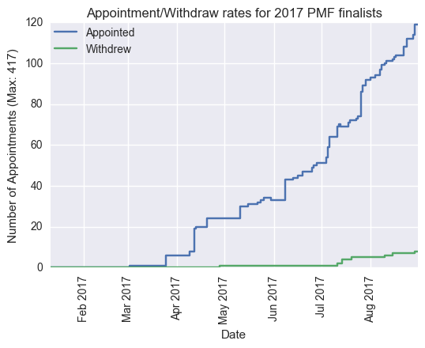
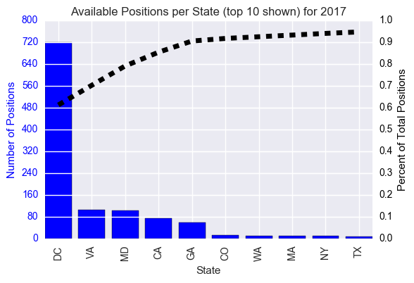

# A collection of data and analysis of the PMF program
This repository contains csv files of collected data, iPython notebooks, select images, and an overall report on various elements of the Presidential Management Fellows Program.

Note: This is an ongoing project and all graphs, tables, and conclusions are subject to change.

The report is saved as a pdf under GitHub_PMF_Report.pdf

That report has 3 main sections:

1) The recent history of the PMF Finalists, focusing on the growth in the share of Finalists from a few pipeline schools

2) A look into the advanced degrees and appointment rates for the 2016 and 2017 Finalist classes

3) Some analysis on the jobs offered to the 2017 Finalists this year.

Most of the data and ipython notebooks used in the report are saved in the folder PMF_Github. Additionally, select figures from that report are saved in that folder to be included in this readme.

I plan on updating the data and python notebooks on a semi-frequent basis. The overall report will be updated less frequently.

Select figures from report:

Trend in fraction of Finalists coming from the most finalist producing schools:

Over recent years, the top schools have had their share of Finalists increase at the expense of other, less prolific institutions.

Appoint rate for 2017 Finalists:

Number of postings and positions available on the PMF job board (TMS) over the course of the year:

(As of April 27, 2017: total postings: 361 Total positions: 920)

The distributions in which agencies are posting, the titles of posted positions, and the location of each position:

(Plus a word cloud of the descriptions of positions:)

